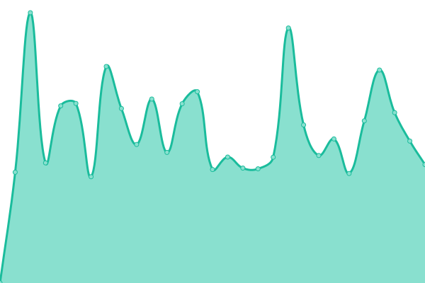
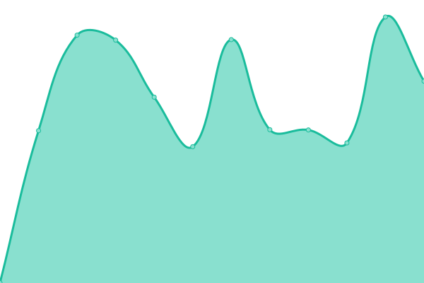

# [📈 Live Status](https://manueldeutsch.github.io/upptime): <!--live status--> **🟩 All systems operational**

This repository contains the open-source uptime monitor and status page for [Manuel Deutsch](https://www.manuel-deutsch.de/?likes=github), powered by [Upptime](https://github.com/upptime/upptime).

With [Upptime](https://upptime.js.org), you can get your own unlimited and free uptime monitor and status page, powered entirely by a GitHub repository. We use [Issues](https://github.com/manueldeutsch/upptime/issues) as incident reports, [Actions](https://github.com/manueldeutsch/upptime/actions) as uptime monitors, and [Pages](https://manueldeutsch.github.io/upptime) for the status page.

<!--start: status pages-->
<!-- This summary is generated by Upptime (https://github.com/upptime/upptime) -->
<!-- Do not edit this manually, your changes will be overwritten -->
<!-- prettier-ignore -->
| URL | Status | History | Response Time | Uptime |
| --- | ------ | ------- | ------------- | ------ |
|  [Datenwerkbank](https://www.datenwerkbank.de) | 🟩 Up | [datenwerkbank.yml](https://github.com/manueldeutsch/upptime/commits/HEAD/history/datenwerkbank.yml) | 

 979ms
     
 | 

<a href="https://status.datenwerkbank.de/history/datenwerkbank">97.50%</a>
    

|  [Manuel Deutsch](https://www.manuel-deutsch.de) | 🟩 Up | [manuel-deutsch.yml](https://github.com/manueldeutsch/upptime/commits/HEAD/history/manuel-deutsch.yml) | 

 1401ms
     
 | 

<a href="https://status.datenwerkbank.de/history/manuel-deutsch">97.51%</a>
    

|  [Uplift Founders](https://upliftfounders.com) | 🟩 Up | [uplift-founders.yml](https://github.com/manueldeutsch/upptime/commits/HEAD/history/uplift-founders.yml) | 

 830ms
     
 | 

<a href="https://status.datenwerkbank.de/history/uplift-founders">100.00%</a>
    

|  [Kinder & Klinik](https://www.kinder-und-klinik.de) | 🟩 Up | [kinder-and-klinik.yml](https://github.com/manueldeutsch/upptime/commits/HEAD/history/kinder-and-klinik.yml) | 

 919ms
     
 | 

<a href="https://status.datenwerkbank.de/history/kinder-and-klinik">97.99%</a>
    

|  [Kaarisma](https://www.kaarisma.de) | 🟩 Up | [kaarisma.yml](https://github.com/manueldeutsch/upptime/commits/HEAD/history/kaarisma.yml) | 

 875ms
     
 | 

<a href="https://status.datenwerkbank.de/history/kaarisma">100.00%</a>
    

|  [Fingolex](https://fingolex.com) | 🟩 Up | [fingolex.yml](https://github.com/manueldeutsch/upptime/commits/HEAD/history/fingolex.yml) | 

 737ms
     
 | 

<a href="https://status.datenwerkbank.de/history/fingolex">100.00%</a>
    

|  [Jerrit](https://www.jerritpeinelt.com) | 🟩 Up | [jerrit.yml](https://github.com/manueldeutsch/upptime/commits/HEAD/history/jerrit.yml) | 

 905ms
     
 | 

<a href="https://status.datenwerkbank.de/history/jerrit">98.01%</a>
    

|  [IBB](https://ibb-woern.de) | 🟩 Up | [ibb.yml](https://github.com/manueldeutsch/upptime/commits/HEAD/history/ibb.yml) | 

 864ms
     
 | 

<a href="https://status.datenwerkbank.de/history/ibb">100.00%</a>
    

|  [Karlsruher Kind](https://www.karlsruher-kind.de) | 🟩 Up | [karlsruher-kind.yml](https://github.com/manueldeutsch/upptime/commits/HEAD/history/karlsruher-kind.yml) | 

 1150ms
     
 | 

<a href="https://status.datenwerkbank.de/history/karlsruher-kind">99.64%</a>
    

|  [Bären Marbach](https://www.baeren-marbach.de) | 🟩 Up | [baeren-marbach.yml](https://github.com/manueldeutsch/upptime/commits/HEAD/history/baeren-marbach.yml) | 

 640ms
     
 | 

<a href="https://status.datenwerkbank.de/history/baeren-marbach">100.00%</a>
    

<!--end: status pages-->

[**Visit our status website →**](https://manueldeutsch.github.io/upptime)

## 📄 License

- Powered by: [Upptime](https://github.com/upptime/upptime)
- Code: [MIT](./LICENSE) © [Manuel Deutsch](https://www.manuel-deutsch.de/?likes=github)
- Data in the `./history` directory: [Open Database License](https://opendatacommons.org/licenses/odbl/1-0/)
