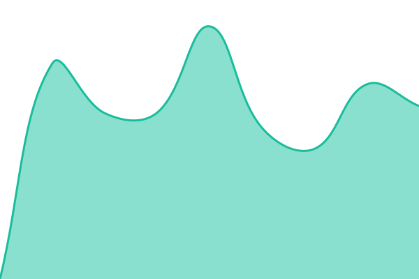
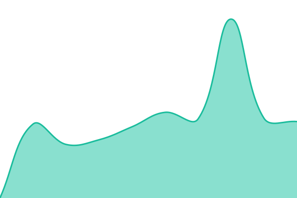

# [📈 Live Status](https://manueldeutsch.github.io/upptime): <!--live status--> **🟩 All systems operational**

This repository contains the open-source uptime monitor and status page for [Manuel Deutsch](https://www.manuel-deutsch.de/?likes=github), powered by [Upptime](https://github.com/upptime/upptime).

With [Upptime](https://upptime.js.org), you can get your own unlimited and free uptime monitor and status page, powered entirely by a GitHub repository. We use [Issues](https://github.com/manueldeutsch/upptime/issues) as incident reports, [Actions](https://github.com/manueldeutsch/upptime/actions) as uptime monitors, and [Pages](https://manueldeutsch.github.io/upptime) for the status page.

<!--start: status pages-->
<!-- This summary is generated by Upptime (https://github.com/upptime/upptime) -->
<!-- Do not edit this manually, your changes will be overwritten -->
<!-- prettier-ignore -->
| URL | Status | History | Response Time | Uptime |
| --- | ------ | ------- | ------------- | ------ |
|  [Datenwerkbank](https://www.datenwerkbank.de) | 🟩 Up | [datenwerkbank.yml](https://github.com/manueldeutsch/upptime/commits/HEAD/history/datenwerkbank.yml) | 

 1006ms
     
 | 

<a href="https://status.datenwerkbank.de/history/datenwerkbank">100.00%</a>
    

|  [Manuel Deutsch](https://www.manuel-deutsch.de) | 🟩 Up | [manuel-deutsch.yml](https://github.com/manueldeutsch/upptime/commits/HEAD/history/manuel-deutsch.yml) | 

 1398ms
     
 | 

<a href="https://status.datenwerkbank.de/history/manuel-deutsch">100.00%</a>
    

|  [Kinder & Klinik](https://www.kinder-und-klinik.de) | 🟩 Up | [kinder-and-klinik.yml](https://github.com/manueldeutsch/upptime/commits/HEAD/history/kinder-and-klinik.yml) | 

 928ms
     
 | 

<a href="https://status.datenwerkbank.de/history/kinder-and-klinik">100.00%</a>
    

|  [Kaarisma](https://www.kaarisma.de) | 🟩 Up | [kaarisma.yml](https://github.com/manueldeutsch/upptime/commits/HEAD/history/kaarisma.yml) | 

 998ms
     
 | 

<a href="https://status.datenwerkbank.de/history/kaarisma">100.00%</a>
    

|  [Karlsruher Kind](https://www.karlsruher-kind.de) | 🟩 Up | [karlsruher-kind.yml](https://github.com/manueldeutsch/upptime/commits/HEAD/history/karlsruher-kind.yml) | 

 1315ms
     
 | 

<a href="https://status.datenwerkbank.de/history/karlsruher-kind">100.00%</a>
    

|  [Akademie](https://www.akademie-lernpaedagogik.de) | 🟩 Up | [akademie.yml](https://github.com/manueldeutsch/upptime/commits/HEAD/history/akademie.yml) | 

 654ms
     
 | 

<a href="https://status.datenwerkbank.de/history/akademie">100.00%</a>
    

|  [Kern](https://kern-weine.de) | 🟩 Up | [kern.yml](https://github.com/manueldeutsch/upptime/commits/HEAD/history/kern.yml) | 

 1373ms
     
 | 

<a href="https://status.datenwerkbank.de/history/kern">100.00%</a>
    

|  [hailteam](https://www.hailteam.de) | 🟩 Up | [hailteam.yml](https://github.com/manueldeutsch/upptime/commits/HEAD/history/hailteam.yml) | 

 1197ms
     
 | 

<a href="https://status.datenwerkbank.de/history/hailteam">100.00%</a>
    

|  [studio sodele](https://www.studiosodele.de) | 🟩 Up | [studio-sodele.yml](https://github.com/manueldeutsch/upptime/commits/HEAD/history/studio-sodele.yml) | 

 1050ms
     
 | 

<a href="https://status.datenwerkbank.de/history/studio-sodele">100.00%</a>
    

|  [Praxis kranaster](https://www.praxis-kranaster.de) | 🟩 Up | [praxis-kranaster.yml](https://github.com/manueldeutsch/upptime/commits/HEAD/history/praxis-kranaster.yml) | 

 1895ms
     
 | 

<a href="https://status.datenwerkbank.de/history/praxis-kranaster">100.00%</a>
    

|  [Spieth](https://www.ib-spieth.de) | 🟩 Up | [spieth.yml](https://github.com/manueldeutsch/upptime/commits/HEAD/history/spieth.yml) | 

 1057ms
     
 | 

<a href="https://status.datenwerkbank.de/history/spieth">100.00%</a>
    

|  [Michael](https://lehner-coaching.ch) | 🟩 Up | [michael.yml](https://github.com/manueldeutsch/upptime/commits/HEAD/history/michael.yml) | 

 1124ms
     
 | 

<a href="https://status.datenwerkbank.de/history/michael">100.00%</a>
    

|  [Pyrum](https://www.pyrum.net) | 🟩 Up | [pyrum.yml](https://github.com/manueldeutsch/upptime/commits/HEAD/history/pyrum.yml) | 

 1162ms
     
 | 

<a href="https://status.datenwerkbank.de/history/pyrum">100.00%</a>
    

|  [Kanzlei](https://www.kanzleisieben.de) | 🟩 Up | [kanzlei.yml](https://github.com/manueldeutsch/upptime/commits/HEAD/history/kanzlei.yml) | 

 1450ms
     
 | 

<a href="https://status.datenwerkbank.de/history/kanzlei">100.00%</a>
    

<!--end: status pages-->

[**Visit our status website →**](https://manueldeutsch.github.io/upptime)

## 📄 License

- Powered by: [Upptime](https://github.com/upptime/upptime)
- Code: [MIT](./LICENSE) © [Manuel Deutsch](https://www.manuel-deutsch.de/?likes=github)
- Data in the `./history` directory: [Open Database License](https://opendatacommons.org/licenses/odbl/1-0/)
